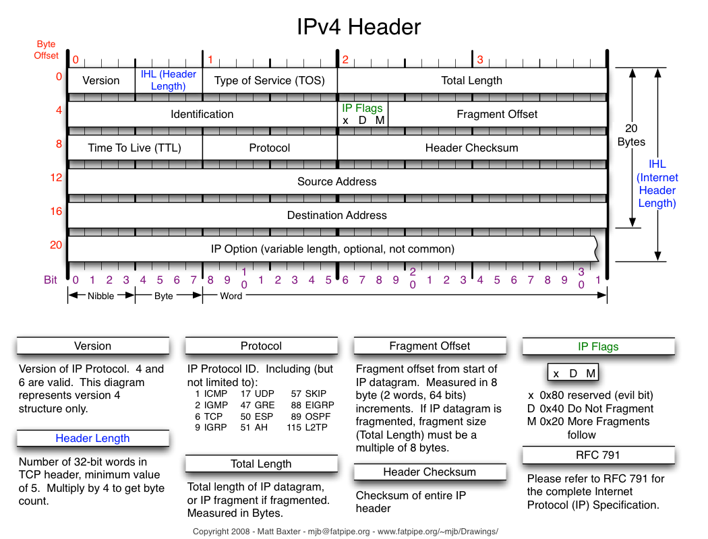
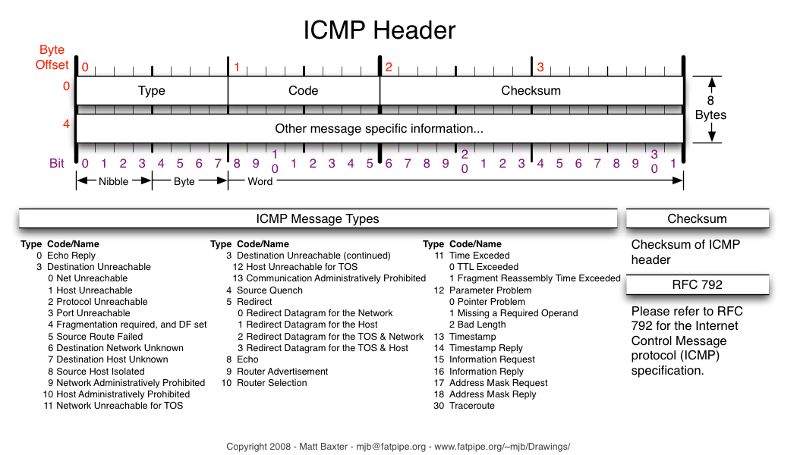

# Readme

Demostrate c++ example tun operation and tcp handshake on tun channel by studying following stream.

code based on following lecture:  
youtube <https://www.youtube.com/watch?v=bzja9fQWzdA>  
code <https://github.com/jonhoo/rust-tcp>  

see same lab rust project [here](https://github.com/corbamico/tun_rx_libtcp)

## Dependencies

* [libviface](https://github.com/HPENetworking/libviface)

  ```shell
  make && make install
  ```  
  if libviface.so.1.1.0 cannot loaded, copy it to LD_LIBRARY_PATH

* asio (standalone mode) and libtins

  ```shell
  sudo apt-get install libasio-dev libtins-dev
  ```

## laboratory

### lab1

* description  
  Hump hex stream, which received from tun.

  ```shell
  mkdir build && cd build && cmake .. && make
  #run lab1 as 
  bin/lab1/lab1
  #open another shell to send tcp package
  nc -s 10.0.0.1 10.0.0.5 8000
  ```

### lab2

* description  
  icmp ping ack server, which received from tun.

### lab3

* description  
  icmp ping ack server, re-factory lab2, using separate read/write buffer.

### lab4

* description  
  simple tcp server, handle syn/psh/fin tcp connection, and print tcp payload on std::cout.

### lab5

* description  
  simple tcp server/session, handle all tcp status transaction of server side via using boost::sml state_machine


## Reference

### IP Header V4



### ICMP Header



## License

>Copyright (C) 2019 corbamico
>
>Licensed under the Apache License, Version 2.0 (the "License");  
>you may not use this file except in compliance with the License.  
>You may obtain a copy of the License at  
>
>http://www.apache.org/licenses/LICENSE-2.0  
>
>Unless required by applicable law or agreed to in writing,  
>software distributed under the License is distributed on an  
>"AS IS" BASIS, WITHOUT WARRANTIES OR CONDITIONS OF ANY  
>KIND, either express or implied.  See the License for the  
>specific language governing permissions and limitations  
>under the License.  